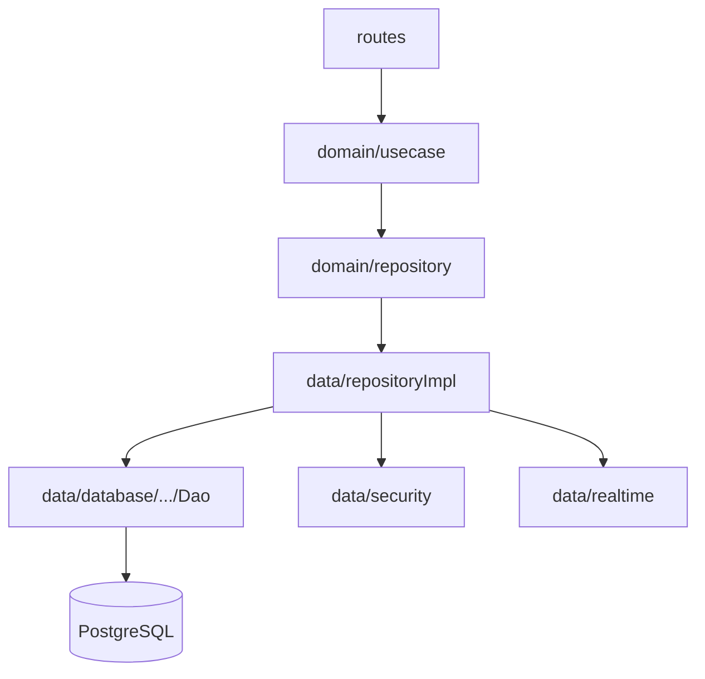

# Guía para agentes

## Arquitectura en capas

Flujo obligatorio para features HTTP (salvo wiring en `Application.kt`):

```
routes/
  → domain/usecase/
    → domain/repository/   (interfaz)
      → data/repositoryImpl/
        → data/database/{tabla}/   ({Tabla}Dao, {Tabla}Table)
        → data/security/           (JWT, APIs externas, hashing)
        → data/realtime/           (WebSocket / broadcast)
```



### Responsabilidades

| Capa | Responsabilidad | No debe |
|------|-----------------|--------|
| **routes** | HTTP/WS: auth Ktor, deserializar body, mapear `*Result` → status + JSON | Lógica de negocio, SQL, llamadas Graph/Groq/Firebase |
| **domain/usecase** | Orquestación mínima entre repositorios (idealmente una línea por método) | Validaciones pesadas, hashing, tokens, mapeo entidad↔DTO |
| **domain/repository** | Contratos que el dominio necesita | Implementación ni acceso a BD |
| **data/repositoryImpl** | Validación, reglas, tokens, mapeos, composición de DAOs y clientes externos | Conocer Ktor `ApplicationCall` |
| **DAO / Table** | Exposed: lectura/escritura de filas | Reglas de negocio, respuestas HTTP |

---

## Mapa de carpetas

| Qué | Dónde |
|-----|--------|
| Punto de entrada y **composition root** (manual DI) | `Application.kt` → `module()` |
| Plugins Ktor (JSON, JWT, StatusPages, WebSockets) | `plugins/Plugins.kt` |
| Endpoints REST/WS | `routes/` (`*Routes.kt`, helpers en `AuthExt.kt`) |
| Casos de uso | `domain/usecase/` (`*UseCase.kt`, `*Result.kt`, modelos internos p. ej. `OrderDraft`) |
| Interfaces de repositorio | `domain/repository/` |
| Implementaciones | `data/repositoryImpl/` |
| DTOs serializables, requests/responses API | `data/mapper/` (`*Dtos.kt`, funciones `toResponse()`) |
| Códigos de error API | `data/enum/` (`*ErrorCode.kt`, estados como `OrderStatus`) |
| BD: config + pool | `data/database/` (`DatabaseConfig`, `DatabaseFactory`) |
| BD: tabla + DAO por agregado | `data/database/{tabla}/` (`{Tabla}Table.kt`, `{Tabla}Dao.kt`, a veces `*Entity`) |
| Secretos, JWT, WhatsApp, Groq, Firebase | `data/security/` (`*Config.from(...)`, `TokenService`, `PasswordHasher`) |
| Broadcast de pedidos en vivo | `data/realtime/` (`OrderSocketManager`) |

Documentación de API y variables de entorno: [`README.md`](README.md).

---

## Reglas de implementación

1. **Casos de uso sin lógica de negocio** — delegar en el repositorio. Referencia: `AuthUseCase`, `MessageUseCase`, `WebhookUseCase` (un método → una llamada al repo).

2. **Lógica en `data/repositoryImpl/`** — validaciones, conflictos (`409`), hashing, emisión JWT, integración WhatsApp/Groq/FCM, ensamblado de respuestas.

3. **DAO solo persiste** — queries Exposed; sin reglas de tienda/usuario salvo filtros puramente data-access.

4. **DTOs `@Serializable` solo en `data/mapper/`** — no definir bodies/responses en `routes/` ni en tablas.

5. **Enums de API y dominio persistido** en `data/enum/`.

6. **Configuración y credenciales** — leer de variables de entorno (y `application.conf` solo para host/puerto u opciones no secretas). Patrón: `FooConfig.from(environment.config, System.getenv())` en `data/security/` o `DatabaseConfig.from(...)`.

7. **Tablas** dentro de `data/database/{tabla}/`, registradas vía `DatabaseFactory`.

8. **Errores HTTP** — códigos en `data/enum/*ErrorCode.kt`; en routes usar `code.toResponse()` desde mappers cuando exista.

9. **Resultados de operación** — sealed classes / enums en `domain/usecase/` (`AuthResult`, `OrderResult`, …). Las routes traducen cada variante a status y cuerpo JSON.

10. **Nuevo feature (checklist)**
    - Tabla + DAO si hace falta persistencia
    - DTOs en `data/mapper/`
    - `domain/repository/XRepository.kt`
    - `data/repositoryImpl/XRepositoryImpl.kt`
    - `domain/usecase/XUseCase.kt` + `XResult.kt` si aplica
    - `routes/XRoutes.kt`
    - Registrar dependencias en `Application.module()`
    - Actualizar `README.md` si cambia contrato HTTP o env vars

---

## Convenciones en `routes/`

- Autenticación JWT: `authenticate(JWT_AUTH_NAME)`; `call.userId()` desde `AuthExt.kt`.
- WebSocket `/orders/ws`: token en query (`TokenService.userIdFromToken`), no header Bearer.
- Recibir body con `receive<RequestDto>()`; responder DTOs o `{ "error": "<code>" }` según README.
- Mantener routes delgadas: parseo de query (p. ej. lista de `OrderStatus`) puede quedarse en route; reglas de autorización de tienda preferible en repositorio (ver deuda abajo).

---

## Composition root (`Application.kt`)

No usar framework DI: instanciar DAOs → repos → use cases → `configure*` plugins → `routing { ... }`.

Orden típico al añadir un módulo:

1. DAOs nuevos
2. `XRepositoryImpl(...)`
3. `XUseCase(...)`
4. `xRoutes(xUseCase)` dentro de `routing`

`WebhookRepositoryImpl` es el agregador más grande (WhatsApp + IA + sesiones + pedidos + push + sockets); cambios en flujo conversacional suelen tocarse ahí o en repos que inyecta.

---

## Patrones ya usados (no romper sin motivo)

- Los **repositorios de dominio** pueden importar DTOs de `data/mapper/` en firmas (p. ej. `RegisterRequest`, `OrderResponse`). No mover esos tipos a `domain/` salvo refactor explícito.
- **`MessageOption`** vive en `domain/repository/MessageRepository.kt` como tipo auxiliar del contrato de mensajes interactivos; alternativa futura: `data/mapper/MessageDtos.kt`.
- **Modelos de flujo interno** (`OrderDraft`, `SessionInfo`, `WebhookStatus`) en `domain/usecase/` — no son JSON público; distintos de DTOs de API.
- **Push / realtime**: `OrderSocketManager` se inyecta en webhook/order routes; notificaciones vía `NotificationRepositoryImpl` + Firebase.

---

## Deuda arquitectónica y mejoras recomendadas

Revisión del código actual frente a las reglas:

| Área | Situación | Mejora sugerida |
|------|-----------|-----------------|
| `OrderUseCase` | Resuelve tienda del usuario y comprueba `storeId` antes de leer/actualizar pedidos | Mover “scoped by user store” a `OrderRepository` (p. ej. `getOrdersForUser(userId, statuses)`) y dejar el use case como delegación pura |
| Orquestación multi-repo | `OrderUseCase` depende de `StoreRepository` + `OrderRepository` | Métodos de repositorio que encapsulen la composición, o un `OrderRepositoryImpl` que ya reciba `StoreDao` |
| Tests | Pocos o ningún test de capa en el árbol actual | Priorizar tests de `repositoryImpl` con BD embebida o mocks de DAO |
| DI manual | Crece `Application.module()` | Aceptable a escala actual; si crece, módulo por feature sin cambiar reglas de capas |

Al implementar endpoints nuevos **no** extender el patrón de lógica en use case salvo orquestación trivial; preferir APIs de repositorio orientadas al caso (“for authenticated store owner”).

---

## Stack y comandos

- **Run local:** `./gradlew :server:run` (ver `README.md` y `docker compose` para Postgres).
- **Serialización:** Kotlinx JSON vía plugin en `Plugins.kt`.
- **BD:** PostgreSQL + Exposed; URL JDBC o `postgresql://` (Render).

---

## Resumen para el agente

- Respeta el flujo **routes → usecase → repository → repositoryImpl → DAO**.
- Pon lógica nueva en **repositoryImpl**, DTOs en **mapper**, enums en **data/enum**.
- Cablea todo en **Application.kt**; documenta API en **README.md**.
- Si tocas pedidos en vivo: **OrderSocketManager** + secuencia en BD.
- Consulta la tabla de deuda antes de duplicar autorización por tienda en use cases.
